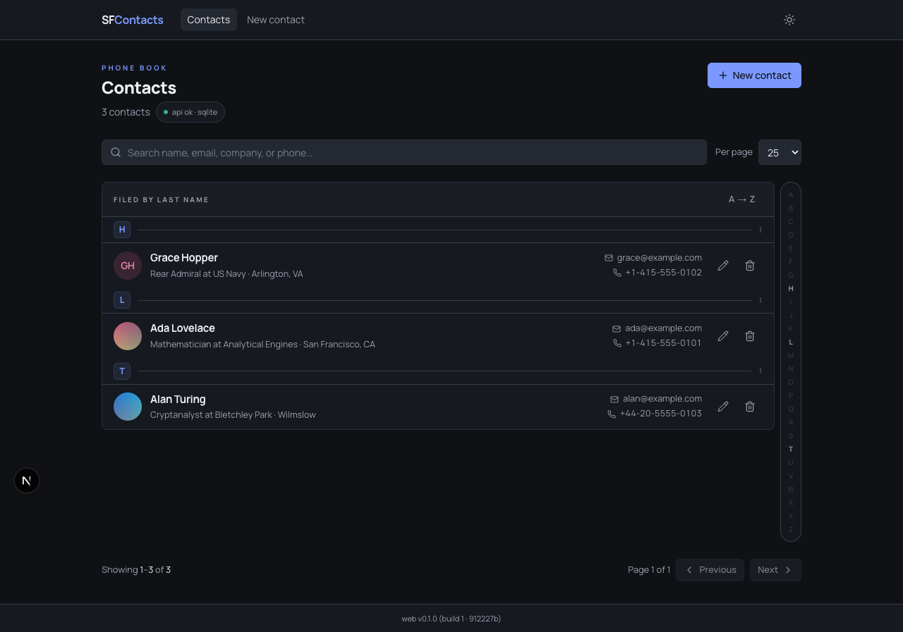
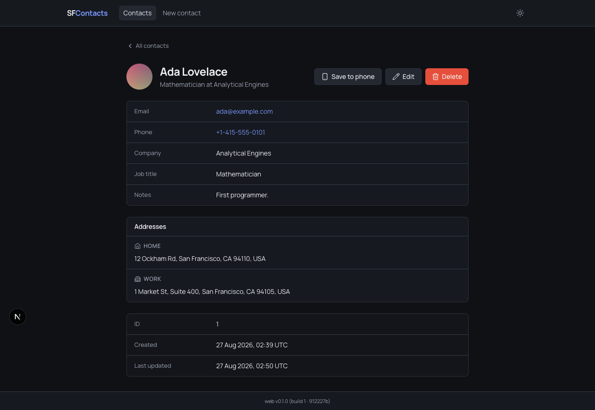
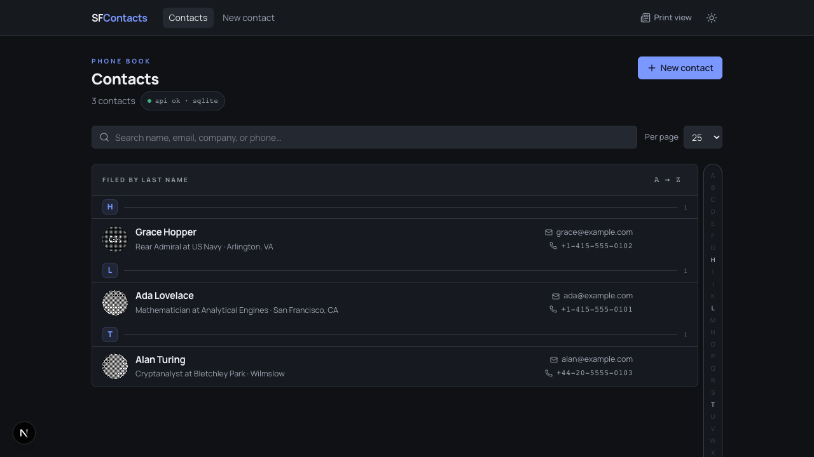

# Roast My PR

A two-hour build at GitHub HQ on 26 August 2026, run by WeMakeDevs with Qodo.
You forked a contacts app, added features, and every feature had to ship through a
pull request that Qodo reviewed before you merged it. Judges scored the merged PRs.

Placed top 10.

## What the app does

A contacts app that reads as a phone book rather than an admin table.

- **Contact photos.** Uploaded in the browser, cropped square, downscaled to 512px and
  encoded as a base64 data URL. Circular avatar, initials when there is no photo.
- **Many addresses per contact.** A real `addresses` table with a foreign key back to
  the contact and a `type` of Home, Work or Other, grouped by type on the detail page.
- **A-Z directory.** Sticky letter headings filed by surname, with a jump rail.
- **Save to phone.** Exports a contact as a vCard 4.0 `.vcf` carrying their photo and
  addresses, so it opens straight into a phone's address book.
- **Print view.** Halftones every avatar through an SVG Bayer filter, the way a phone
  book printed photographs. Display only, off by default.
- **Generate an avatar from the phone number.** For contacts with no photo: the digits
  are hashed into a seed that draws a mirrored tone grid, halftoned with the same matrix.
  The same number always gives the same face.

## The pull requests

The app itself lives in two forks. The work is the PRs.

**Challenge 1, contact photo**
- [sf-backend#1](https://github.com/karimbabasf/sf-backend/pull/1)
- [sf-frontend#1](https://github.com/karimbabasf/sf-frontend/pull/1)

**Challenge 2, multiple addresses**
- [sf-backend#2](https://github.com/karimbabasf/sf-backend/pull/2)
- [sf-frontend#2](https://github.com/karimbabasf/sf-frontend/pull/2)

**Extra features**
- [sf-frontend#3](https://github.com/karimbabasf/sf-frontend/pull/3) directory and vCard export
- [sf-frontend#4](https://github.com/karimbabasf/sf-frontend/pull/4) print view
- [sf-frontend#5](https://github.com/karimbabasf/sf-frontend/pull/5) avatar from phone number
- [sf-backend#3](https://github.com/karimbabasf/sf-backend/pull/3) documentation correction

## Numbers

7 merged pull requests. 27 Qodo review threads, around 60 comments, none left
unanswered. 21 findings fixed, 6 argued, 4 of which Qodo conceded. 164 tests, up from
125 at the start. No new dependencies were added to either repo.

## Stack

Next.js 16, React 19, Tailwind, TypeScript on the front. FastAPI, SQLAlchemy and SQLite
on the back. Qodo for review.
